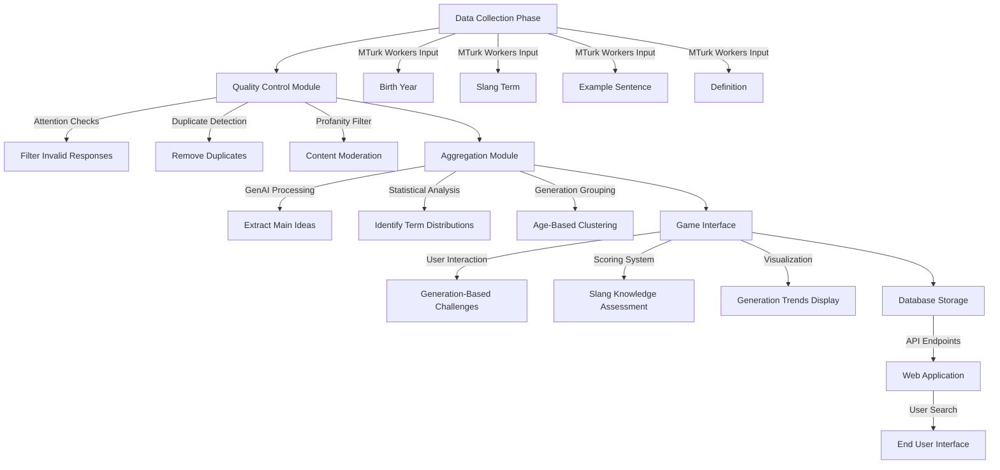

```mermaid
flowchart TD
    A[Data Collection Phase] --> B[Quality Control Module]
    A --> |MTurk Workers Input| A1[Birth Year]
    A --> |MTurk Workers Input| A2[Slang Term]
    A --> |MTurk Workers Input| A3[Example Sentence]
    A --> |MTurk Workers Input| A4[Definition]

    B --> |Attention Checks| B1[Filter Invalid Responses]
    B --> |Duplicate Detection| B2[Remove Duplicates]
    B --> |Profanity Filter| B3[Content Moderation]

    B --> C[Aggregation Module]
    C --> |GenAI Processing| C1[Extract Main Ideas]
    C --> |Statistical Analysis| C2[Identify Term Distributions]
    C --> |Generation Grouping| C3[Age-Based Clustering]

    C --> D[Game Interface]
    D --> |User Interaction| D1[Generation-Based Challenges]
    D --> |Scoring System| D2[Slang Knowledge Assessment]
    D --> |Visualization| D3[Generation Trends Display]

    D --> E[Database Storage]
    E --> |API Endpoints| F[Web Application]
    F --> |User Search| G[End User Interface]
```
