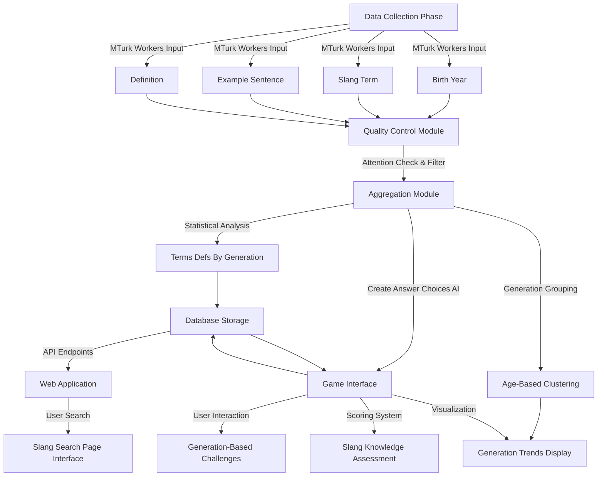

```mermaid
flowchart TD
    A[Data Collection Phase] --> |MTurk Workers Input| A1[Birth Year]
    A --> |MTurk Workers Input| A2[Slang Term]
    A --> |MTurk Workers Input| A3[Example Sentence]
    A --> |MTurk Workers Input| A4[Definition]

    A1 --> B[Quality Control Module]
    A2 --> B
    A3 --> B
    A4 --> B

    B --> |Attention Check & Filter| C[Aggregation Module]

    C --> |Statistical Analysis| C2[Terms Defs By Generation]
    C --> |Generation Grouping| C3[Age-Based Clustering]


    C2 --> E
    C3 --> D3

    C --> |Create Answer Choices AI| D[Game Interface]
    D --> |User Interaction| D1[Generation-Based Challenges]
    D --> |Scoring System| D2[Slang Knowledge Assessment]
    D --> |Visualization| D3[Generation Trends Display]

    D --> E[Database Storage]
    E --> D
    E --> |API Endpoints| F[Web Application]
    F --> |User Search| G[Slang Search Page Interface]
```
